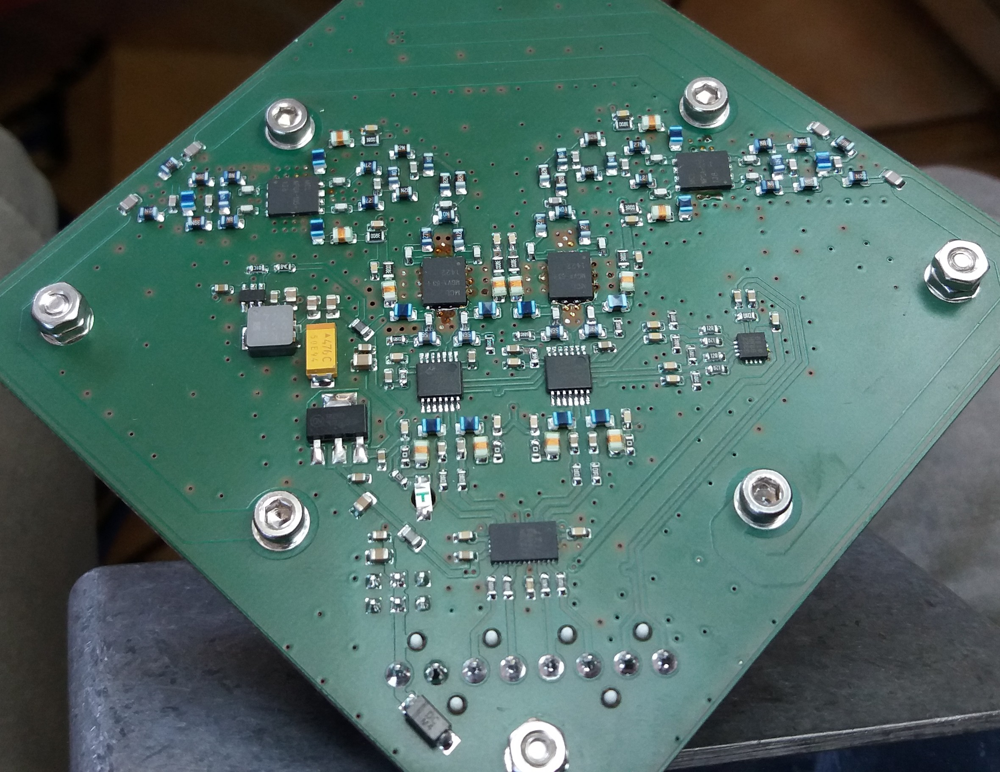

# QFHMIX01D -  QFH active antenna mixer

## Parameters

| Parameter | Value | Description |
|-----------|-------|-------------|
| Frequency range | 100 - 1000 MHz |  |
| Interface | IDC381-8-110 | KRONE Punch down block |
| Operating and storage temperature | -20 - +30°C |  |
| Operational input voltage | 9 - 14.8 V | Internally stabilized to +5V and +3V |
